# GitHub-Actions

##### 공식문서

[GitHub Action Docs](https://docs.github.com/en/actions)

## 시작하기

1. __Action__ 클릭
   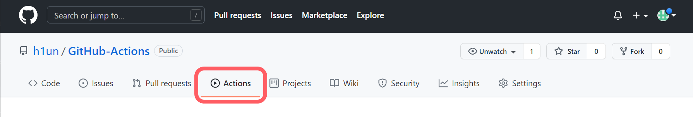
2. set up thist workflow 선택 _[알맞은 워크플로우작성을 선택하면 기본적으로 작성이 되있음]_
   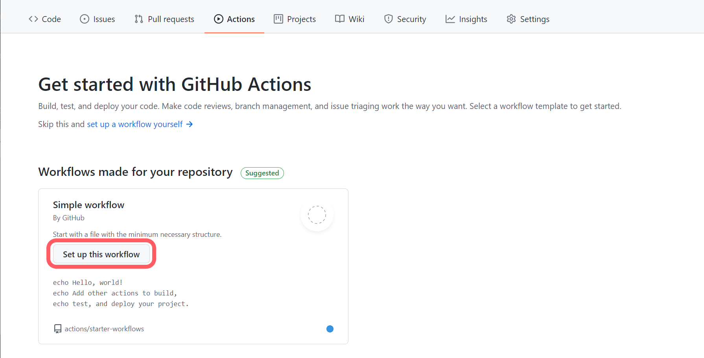
3. .yml 워크플로우 작성 _[maven 워크플로우로 선택함 maven 빌드 작업]_

    ```yml
    name: CI
    on:
        push:
            branches: [ main ]
        pull_request:
            branches: [ main ]
    jobs:
        build:
            runs-on: ubuntu-latest
            steps:
            - uses: actions/checkout@v2
            - name: Set up JDK 11
              uses: actions/setup-java@v2
              with:
                java-version: '11'
                distribution: 'adopt'
                cache: maven
            - name: Build with Maven
              run: mvn -B package --file pom.xml
   ```

   [구문 자세히 알아보기](https://docs.github.com/en/actions/learn-github-actions/understanding-github-actions)
    * `name` : 워크 플로우 이름
    * `on` : 워크플로우 파일을 자동으로 트리거 하는 이벤트 지정
        * `push` : push 할때마다 실행
        * `pull_request` : pull_request 할때마다 실행
            * `branches`
    * `jobs` : 워크 플로 파일에서 실행되는 모든 작업을 그룹화
        * `check-bats-version` : `check-bats-version`에 작업의 이름 정의 , build 자리에 작업의 이름을 넣어주면됨
            * `runs-on: ubuntu-latest` : Ubuntu Linux 실행기에서 실행되도록 작업을 구성<br>
              작업이 GitHub에서 호스팅하는 새로운 가상 머신에서 실행됨을 의미 (러너)
            * `step` : 작업에서 실행되는 모든 단계를 그룹화
                * `-` : 한 작업을 의미
                * `name` : 작업의 이름 _생략 가능 ?_
                * `uses` : uses키워드를 검색하는 작업
                * `uses : ctions/checkout@v2` : 러너에서 레포지토리를 체크아웃하고 러너에 다운로드하여 코드에 대해 실행할수 있도록 하는 작업<br>
                  워크플로우가 레포지토리의 코드에 대해 실행되거나 리포지토리에 정의된 작업을 사용할 때마다 체크아웃 작업을 사용해야 함
                * `uses : actions/setup-java@v2` : 지정된 버전의 소프트웨어 패키지를 설치하는 작업
                    * `with` : 설치 설정 _소프트웨어 패키지는 기본적으로 워크플로우 생성을하면 알아서 생성됨_
                * `run` : 명령어 실행

4. Action 탭에서 확인
   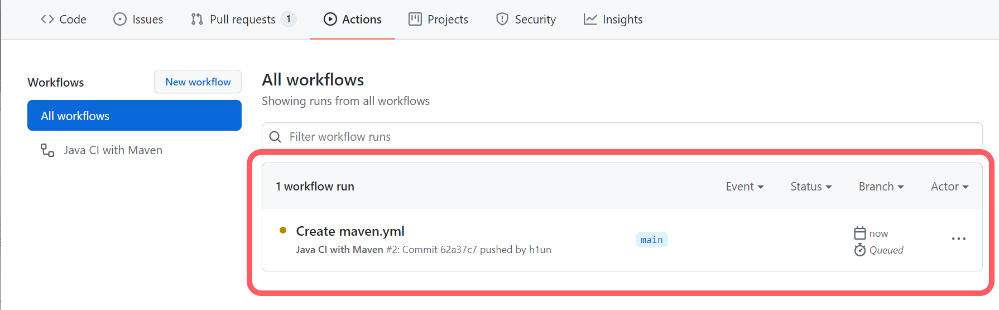
   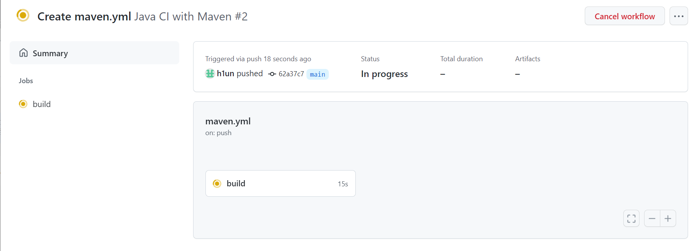
   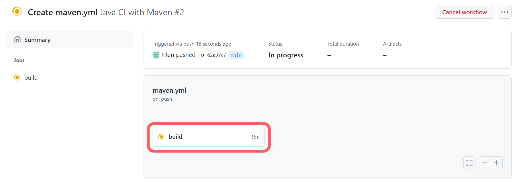
   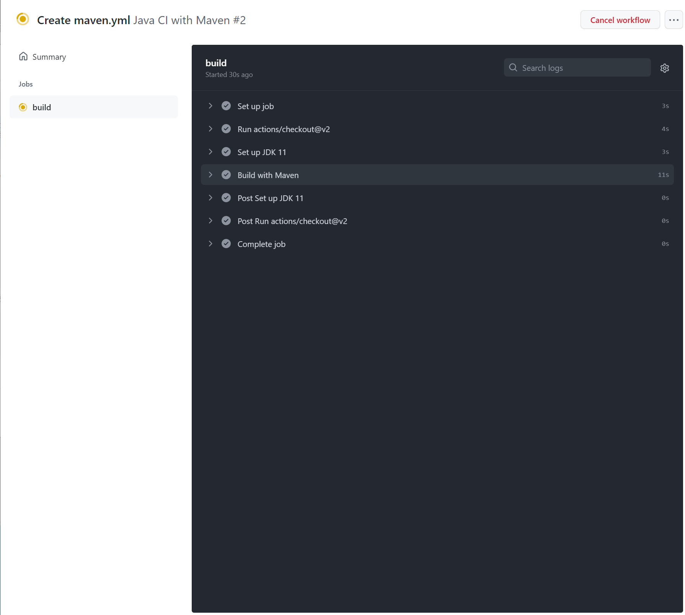
   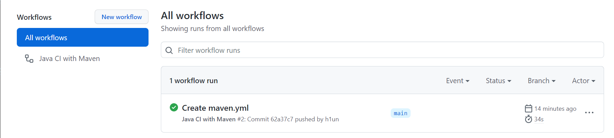

## S3 업로드

1. Marketplace / Action / 탭에서 S3 검색
   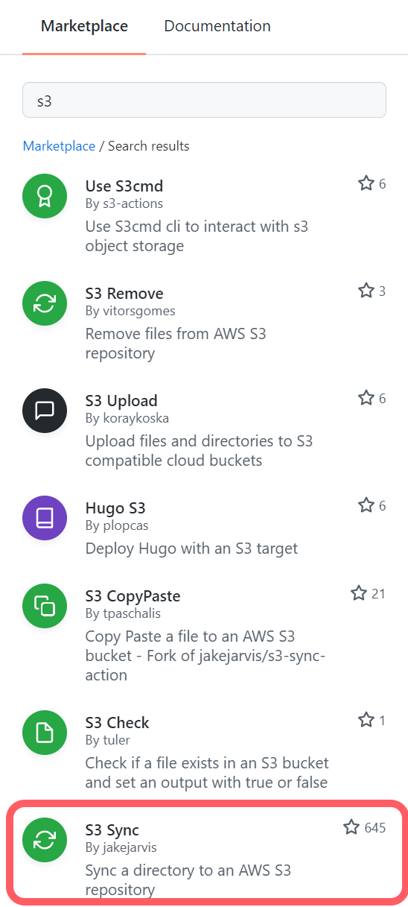
   ###### 💡 우리는 Naver Cloud PLATFORM 의 Object Storage(=S3)에 배포
   ###### Object Storage 버킷 생성
   ###### [Object Storage 공식 문서](https://guide-fin.ncloud-docs.com/docs/storage-objectstorage-objectstorageconsole)
   ###### [Object Storage 사용법](https://blog.naver.com/n_cloudplatform/221359124614)
   ###### 💡💡 Naver Cloud PLATFORM 는 SourceBuild > SourceDeploy > SourcePipeline 를 구성하면 자동화된 배포 프로세스 구성 가능하기에 github actions를 사용 안해도됨.. 
   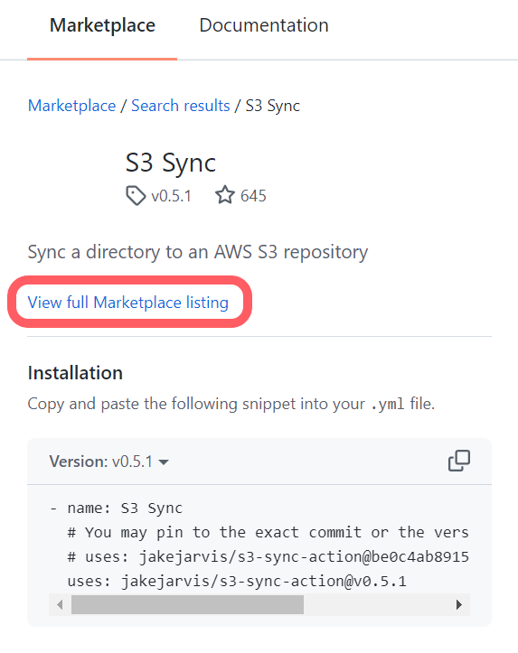
   [사용법 확인](https://github.com/marketplace/actions/s3-sync)
    ```yml
        name: Upload Website
        
        on:
        push:
        branches:
        - master
        
        jobs:
        deploy:
        runs-on: ubuntu-latest
        steps:
        - uses: actions/checkout@master
        - uses: jakejarvis/s3-sync-action@master
        with:
        args: --acl public-read --follow-symlinks --delete
        env:
        AWS_S3_BUCKET: ${{ secrets.AWS_S3_BUCKET }}
        AWS_ACCESS_KEY_ID: ${{ secrets.AWS_ACCESS_KEY_ID }}
        AWS_SECRET_ACCESS_KEY: ${{ secrets.AWS_SECRET_ACCESS_KEY }}
        AWS_REGION: 'us-west-1'   # optional: defaults to us-east-1
        SOURCE_DIR: 'public'      # optional: defaults to entire repository
   ```

2. ${{secrets.[NAME]}} 설정하기 __Settings__ > __Secrets__ > __New repository secret__ 클릭
   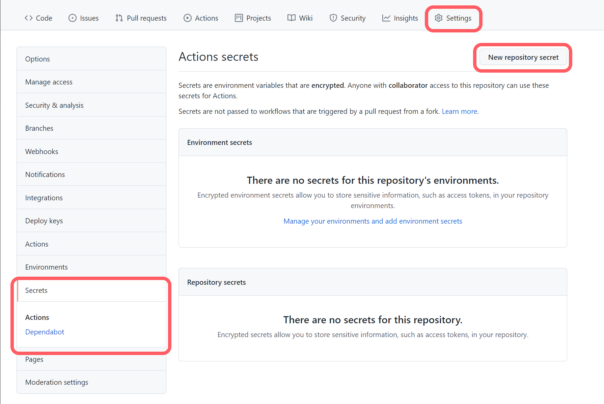
   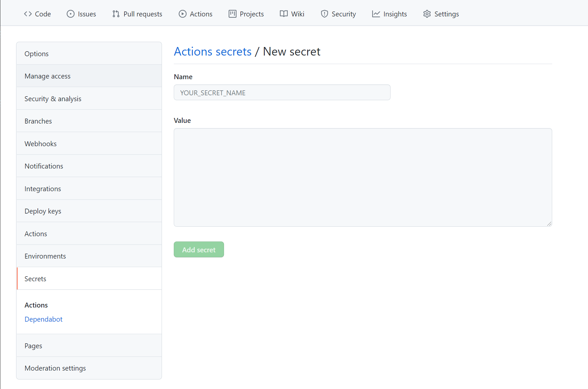
   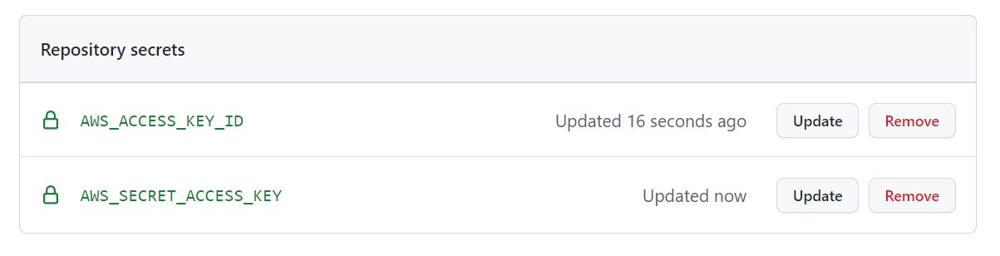
3. .yml 파일 작성
     ```yml
     name: Java CI with Maven
     on:
       push:
         branches: [ master ]
       pull_request:
         branches: [ master ]
    
     jobs:
       build_deploy:
    
       runs-on: ubuntu-latest
    
       steps:
         - uses: actions/checkout@master
         - name: Set up JDK 11
           uses: actions/setup-java@v2
           with:
             java-version: '11'
             distribution: 'adopt'
             cache: maven
         - name: Build with Maven
           run: mvn -B package --file pom.xml
           # 디렉토리 생성
         - name: Make Directory
           run: mkdir -p deploy
           # War 파일 복사
         - name: Copy WAR
           run: cp target/*.war ./deploy
           # 배포
         - name: deploy
           uses: jakejarvis/s3-sync-action@v0.5.1
           with:
             args: --acl public-read --follow-symlinks --delete
           env:
             AWS_S3_BUCKET: websocket
             AWS_ACCESS_KEY_ID: ${{ secrets.AWS_ACCESS_KEY_ID }}
             AWS_SECRET_ACCESS_KEY: ${{ secrets.AWS_SECRET_ACCESS_KEY }}
             AWS_S3_ENDPOINT: https://kr.object.fin-ncloudstorage.com
             DEST_DIR: deploy
             SOURCE_DIR: ./deploy
    
     ```
   ###### 💡 AWS_S3_ENDPOINT 에 네이버클라우드오브젝트스토리지 endpoint를 넣음 _공식문서에서 확인_ 
    


