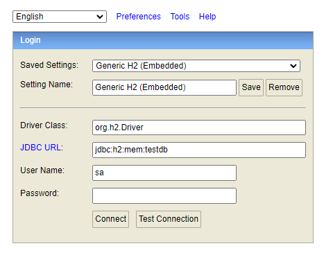
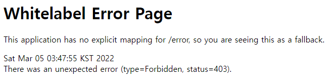

# Spring h2-console 접속 안될때 (403 Error) 
## H2 + SpringSecurity 같이 사용하기

H2 를 사용할 때 SpringSecurity 를 사용하면 h2-console 접속 시 403 에러가 난다. 

이유는 시큐리티가 접근을 막아버리기 때문이다.

    import org.springframework.context.annotation.Configuration;
    import org.springframework.security.config.annotation.web.builders.HttpSecurity;
    import org.springframework.security.config.annotation.web.configuration.EnableWebSecurity;
    import org.springframework.security.config.annotation.web.configuration.WebSecurityConfigurerAdapter;
    
    @Configuration
    @EnableWebSecurity
    public class WebSecurityConfig extends WebSecurityConfigurerAdapter {
    
        @Override
        protected void configure(HttpSecurity http) throws Exception {
             http
                    .authorizeRequests()
                    .antMatchers("/h2-console/**").permitAll()
                    .anyRequest().authenticated()
                    .and()
                    .headers()
                    .frameOptions().disable()
                    .and()
                    .formLogin()
                    .permitAll()
                    .and()
                    .logout()
                    .permitAll()
                    .and()
                    .csrf().disable();  
        }
    }

이렇게 처리해주면 된다.

-      .authorizeRequests()
                    .antMatchers("/h2-console/**").permitAll()
                    .anyRequest().authenticated()
    - "/h2-console/**" 경로에 접근 가능하도록
    - .authorizeRequests() :특정한 경로에 특정한 권한을 가진 사용자만 접근할 수 있도록 메소드 지정
        - .antMatchers("[경로]") 경로 지정
            - .permitAll() 모든 사용자 접근 허용
            - .anyRequest().authenticated() : 그 외 나머지 리소스들은 인증을 완료해야 접근 가능
    
-       .headers()
        .frameOptions().disable()
    - SpringSecurity에서는 X-Frame-Options이 http header에 추가되어 iframe으로 동작하던 기능이 정상적으로 동작하지 않는 이슈가 있다. X-Frame-Options header 추가하는 부분을 다음과 같이 disable 함으로써 문제를 해결할 수 있다.

-       .formLogin()
        .permitAll()
        .and()
        .logout()
        .permitAll()
    - 로그인 로그아웃은 모두 접근 가능
    
-       .csrf().disable()
    
    - SpringSecurity에서는 Cross Site Request Forgery(CSRF)를 방지 장치가 기본으로 탑재되어 있다. 

#### 
- (+) yml 파일

        server:
            servlet:
                encoding:
                    charset: utf-8
                    enabled: true
                    
        spring:
            datasource:
                url: jdbc:h2:mem:testdb
                driverClassName: org.h2.Driver
                username: sa
                password:
        h2:
            console:
                enabled: true
        jpa:
            database-platform: org.hibernate.dialect.H2Dialect

- (+) [스프링시큐리티 Configuration 설정]('https://kimchanjung.github.io/programming/2020/07/02/spring-security-02/')
  - 스프링 시큐리티의 여러가지 설정값들과 역할 정리 
- (+) [스프링시큐리티 공식문서](https://docs.spring.io/spring-security/reference/)
